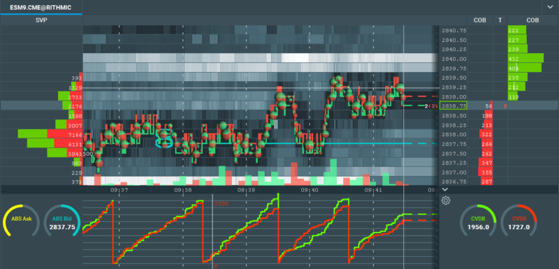

# FV Order Flow Toolkit

This is a suite of 4 tools designed to help traders more easily identify specific data events with user defined variables. As we develop more tools and features periodically they will be added to the Order Flow Tool Set as included updates.

This page will help you setup the addons with sample configuration/settings and screenshots.

If you have any questions or need a custom addon/algo you can get in touch via email: <a href="mailto:fintechvisuals@gmail.com">fintechvisuals@gmail.com</a>

## Demos (Recorded on ES Futures)

* Pace of Tape and Block Orders:
    <iframe width="560" height="315" src="https://www.youtube.com/embed/8YHJ0MhUPqs" frameborder="0" allow="accelerometer; autoplay; encrypted-media; gyroscope; picture-in-picture" allowfullscreen></iframe>

* Cumulative Volume Delta Alert and Block Orders:
    <iframe width="560" height="315" src="https://www.youtube.com/embed/Ac1I5V1FKJc" frameborder="0" allow="accelerometer; autoplay; encrypted-media; gyroscope; picture-in-picture" allowfullscreen></iframe>

* Absorption:

    <iframe width="560" height="315" src="https://www.youtube.com/embed/fH7bMVGqIDk" frameborder="0" allow="accelerometer; autoplay; encrypted-media; gyroscope; picture-in-picture" allowfullscreen></iframe>

## Block Orders

Trigger block trade alerts based on execution side and 3 user adjustable size filters

    Sample Settings for ES Futures:

    1st Level
        Size >= 40 # This will alert at low volume/audio for block trades >= 40 and <= 70
    2nd Level
        Size >= 70 # This will alert at medium volume/audio for block trades >= 70 and <= 120
    3rd Level
        Size >= 120 # This will alert at high volume/audio for block trades >= 120

## CVD (Cumulative Volume Delta)

Cumulative Volume Delta based on a user defined executed volume quantity with a reset threshold using % Imbalance alerts and indicator markers

    Sample Settings for ES Futures:

    Total Volume Reset
        2000 # Total volume traded at bid + ask before the CVD resets
    Alert CVD % >=
        200 # % that the alert will trigger, in this case it will trigger when buy or sell CVD is 200% higher than the other side
    Buy/Sell Line color
        Bookmap Indicator Color for Buy/Sell lines
    Buy/Sell Alert Line Style
        Bookmap Indicator Line Style

## Absorption

Detect high participation trade execution areas commonly referred to as “absorption” with a user defined single or multiple level aggregate volume threshold setting.

    Sample Settings for ES Futures:

    Absorption Trigger >= X
        2500 # This will alert when the absorption on the level (bid or ask) reaches 2500 trades
    Absorption Trigger
        3 # If "Enable Multi Level" is checked, the addon will alert only when 3 levels are >= 2500
    Enable Multi Level
        Checked/Unchecked # This setting will tell the addon if we are using single or multi level for alerts
    Color
        Bookmap Indicator Color for Buy/Sell lines
    Buy/Sell Alert Line Style
        Bookmap Indicator Line Style

## Pace of Tape

Detect instances that exhibit a sudden increase in trade execution activity commonly referred to as Pace of Tape.

Sample Settings for ES Futures:

    Interval Seconds >= X
        1 # This is the interval which the addon will collect trades, in this case every 1 second
    Average Minutes >= X
        1 # The addon will calculate the Average number of trades based on every interval for 1 minute
    Alert POT >= 200
        This will alert a sound when the number of trades in an interval is higher than 200
    POT Color
        Bookmap Indicator Color for POT line
    POT Avg Color
        Bookmap Indicator Color for Avg Line

