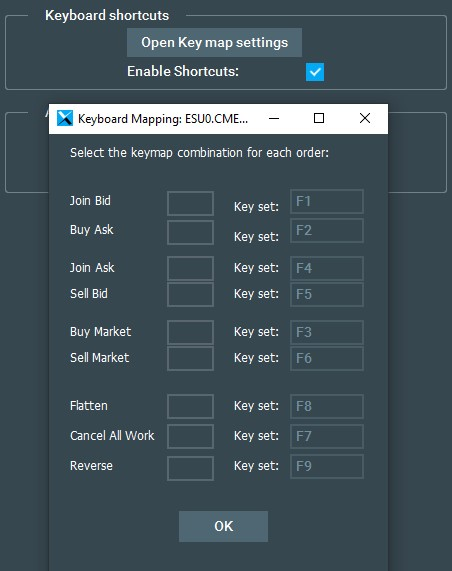

# FV Keyboard Execution

User assignable keyboard shortcuts for quick execution using Bookmap’s Trading Control Panel functions.

# How to set a key

By default the following keys are auto selected:

If you wish to change a key you must click on the left box and then type the key you want to set.

Because you cannot assign the same key to different fields you must first set the left field to a key other than the key you wish to use. Then assign the one you wish to use. For example if I want to set the Buy Ask to F1 key I would have to select the Join Bid first and set it to another key e.g.: "P" and then I will be able to set Buy Ask to F1.

